# ALGUNOS RESULTADOS

# Desde la encuesta

Histograma demanda servicio de taxis por hora (origen vs destino)

Las mejores distribuciones obtenidas desde la encuesta de movilidad para Origen y Destino:

## ORIGIN OF THE SERVICE:

### Gif of each Hour

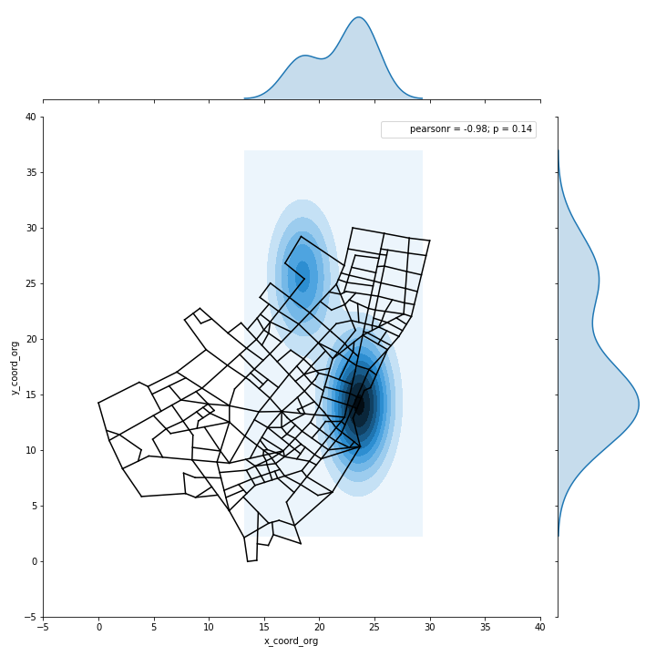

# BEST BLOCKS TIME DISTRIBUTION (ORIGIN)

### 00:00 Hs - 05:00 Hs

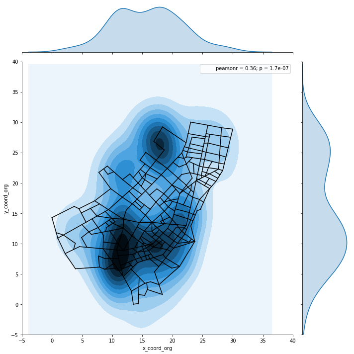

### 06:00 Hs - 11:00 Hs

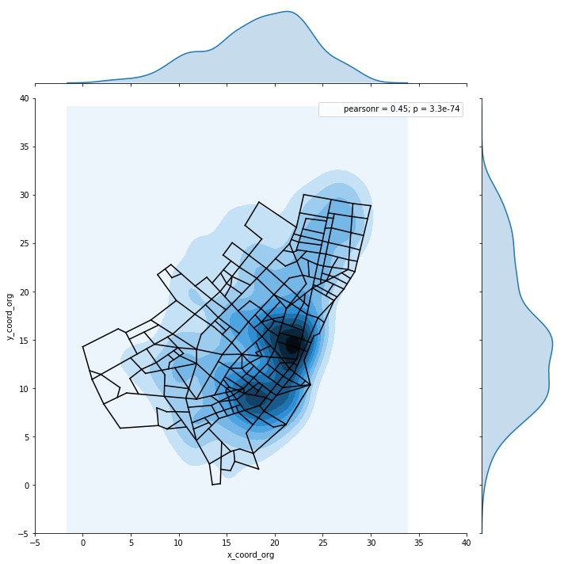

### 12:00 Hs - 17:00 Hs

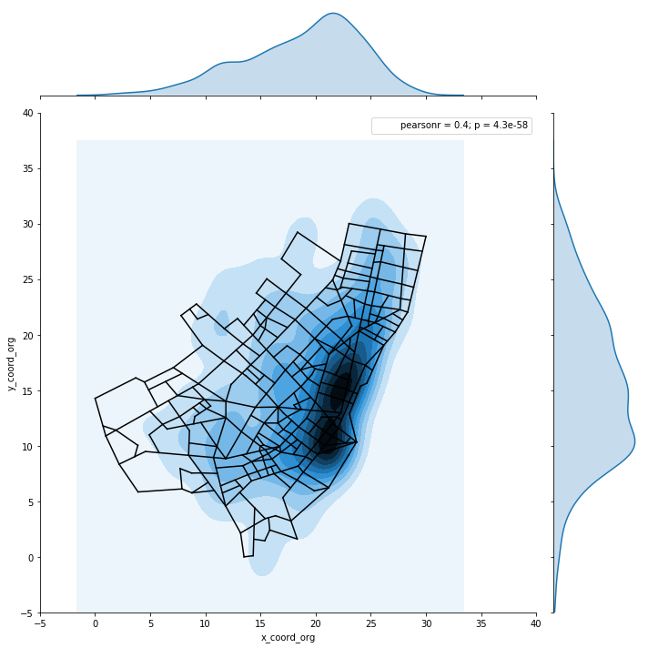

### 18:00 Hs - 23:00 Hs

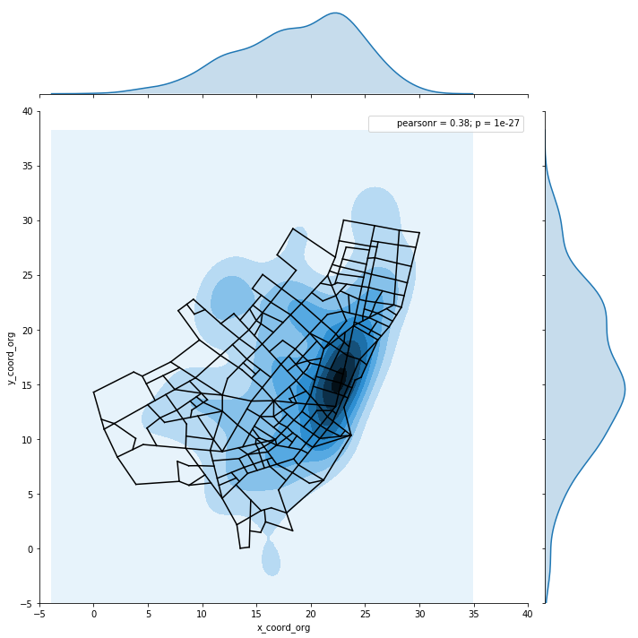

### GIF

## DESTINATION OF THE SERVICE:

### Gif of each Hour

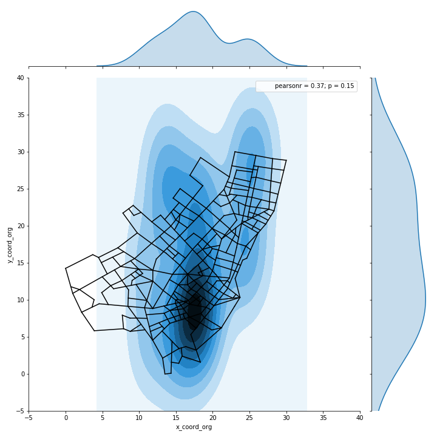

# BEST BLOCKS TIME DISTRIBUTION (ARRIVE)

### 00:00 Hs - 05:00Hs

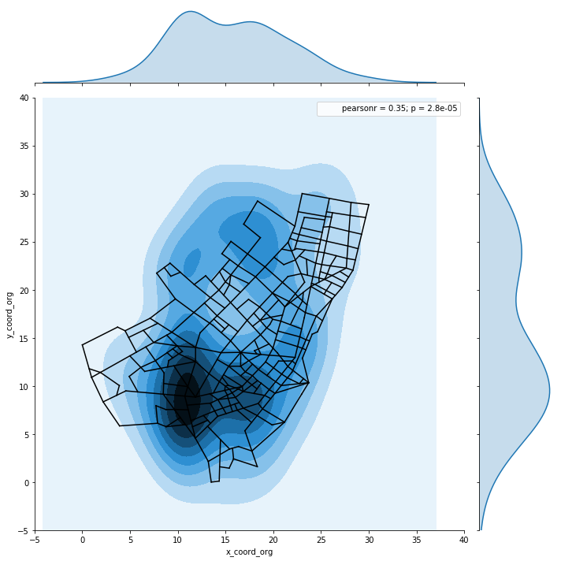

### 06:00 Hs - 13:00Hs

### 14:00 Hs - 19:00Hs

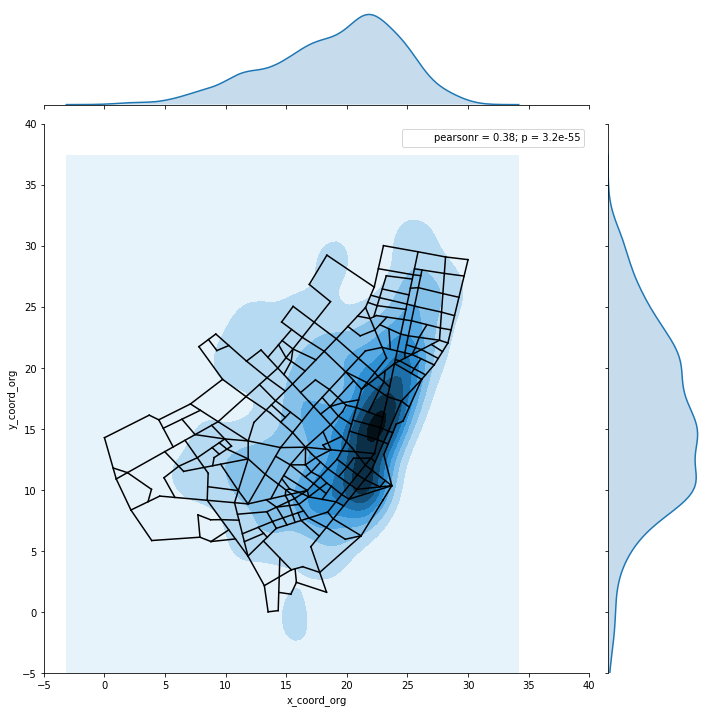

### 20:00 Hs - 23:00Hs

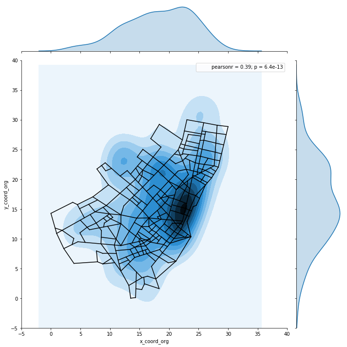

### GIF

# SUMMARY

### Best time distribution for ORIGIN

|  | TIME RANGE |
| --- | --- |
| 1 | 00:00 Hs - 05:00 Hs |  
| 2 | 06:00 Hs - 11:00 Hs |
| 3 | 12:00 Hs - 17:00 Hs |
| 3 | 18:00 Hs - 23:00 Hs |

### Best time distribution for ARRIVE

|  | TIME RANGE |
| --- | --- |
| 1 | 00:00 Hs - 05:00 Hs |  
| 2 | 06:00 Hs - 13:00 Hs |
| 3 | 14:00 Hs - 19:00 Hs |
| 3 | 20:00 Hs - 23:00 Hs |

# Simulación

Diatribuciones obtenidas de la simulación para los mismos bloques de tiempo de origen y destino:

## ORIGIN OF THE SERVICE:

# BEST BLOCKS TIME DISTRIBUTION (ORIGIN)

### 00:00 Hs - 05:00 Hs

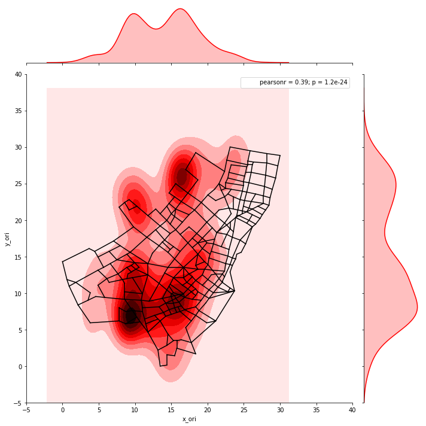

### 06:00 Hs - 11:00 Hs

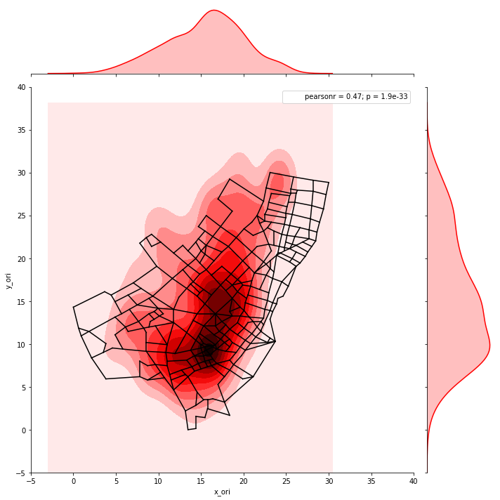

### 12:00 Hs - 17:00 Hs

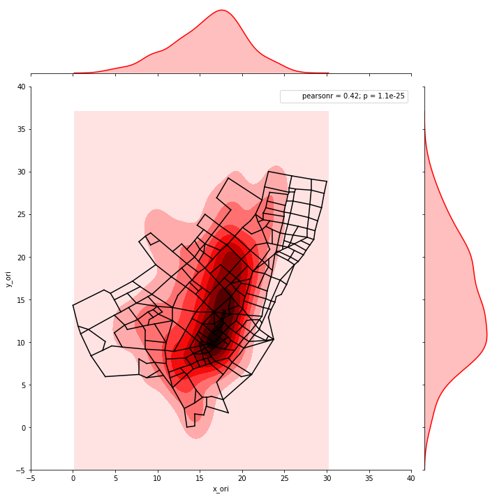

### 18:00 Hs - 23:00 Hs

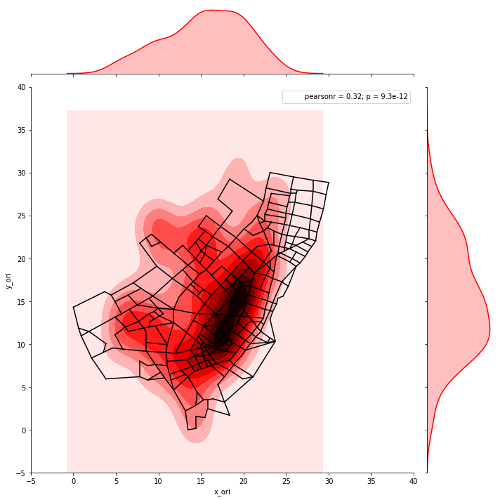

## DESTINATION OF THE SERVICE:

# BEST BLOCKS TIME DISTRIBUTION (ARRIVE)

### 00:00 Hs - 05:00Hs

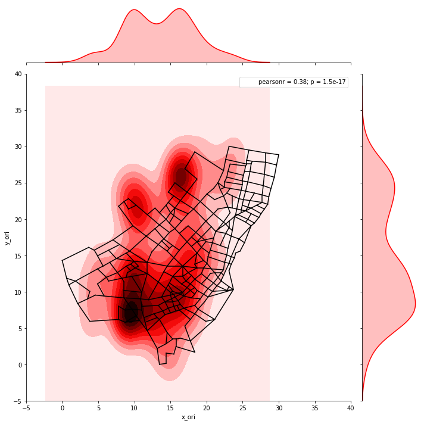

### 06:00 Hs - 13:00Hs

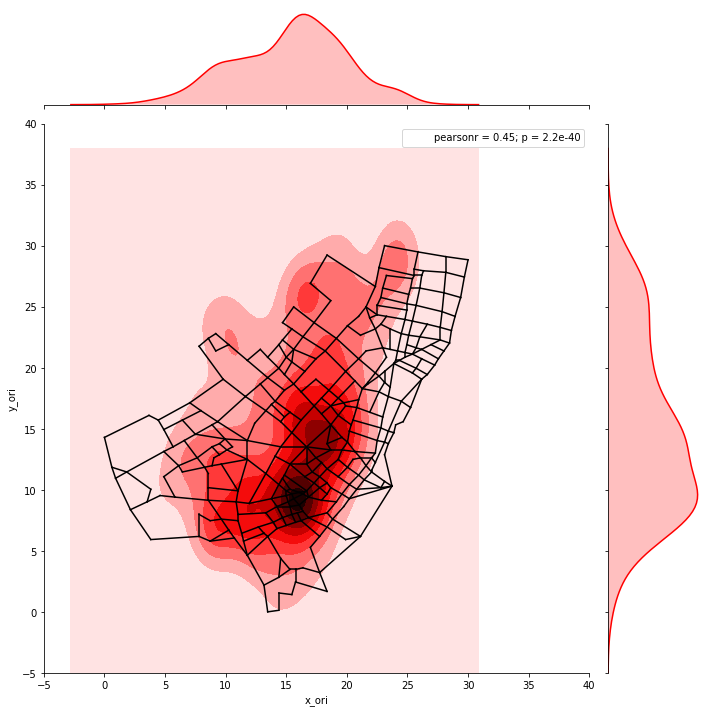

### 14:00 Hs - 19:00Hs

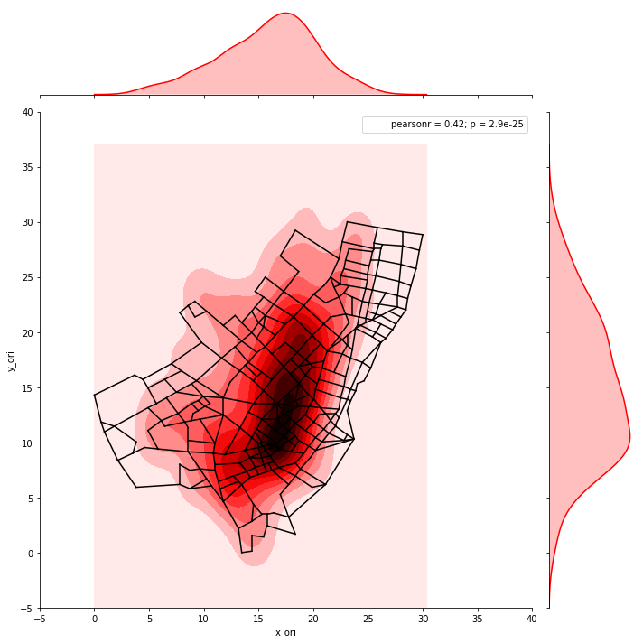

### 20:00 Hs - 23:00Hs

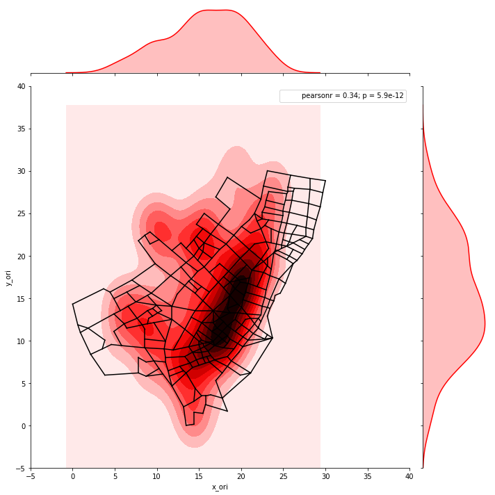
